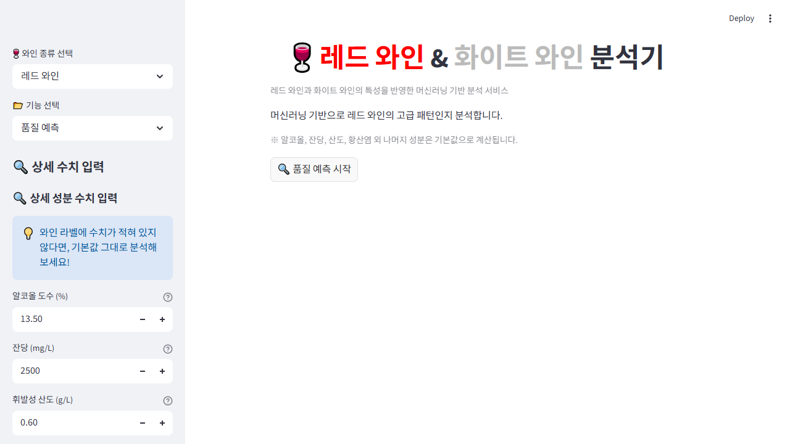

# WINE ML PROJECT

머신러닝으로 와인 품질을 예측하고, 사용자의 취향에 맞는 와인 스타일을 추천하는 개인 프로젝트입니다.  
레드 와인과 화이트 와인 데이터를 각각 활용해 모델을 구성했고, `Streamlit` 기반 프론트엔드를 통해 예측 결과를 웹에서 직접 확인할 수 있도록 구현했습니다.

## 배포 주소

- Streamlit 앱: [https://winemlproject.streamlit.app/](https://winemlproject.streamlit.app/)

## 실행 화면



## 프로젝트 소개

이 프로젝트는 단순히 모델을 학습하는 데서 끝나지 않고, 사용자가 직접 값을 입력하고 결과를 해석할 수 있는 형태의 서비스까지 연결한 점에 의미가 있습니다.

- 레드 와인 / 화이트 와인 품질 예측
- 와인 성분 기반 고급 와인 패턴 분류
- 취향 입력 기반 와인 스타일 추천
- 예측 결과에 따른 스타일 해석, 페어링 추천, 인사이트 제공

## 프론트엔드 구성

프론트는 `Streamlit`으로 구현했습니다.  
사용자는 사이드바에서 와인 종류와 기능을 선택한 뒤, 알코올 도수·잔당·산도·황산염 같은 값을 입력해 결과를 바로 확인할 수 있습니다.

### 주요 화면

`품질 예측`
- 와인 성분 입력
- 머신러닝 기반 품질 예측
- 고급 와인 확률 표시
- 평균 대비 성분 비교
- 와인 스타일 분석
- 음식 / 치즈 페어링 추천

`취향 매치`
- 단맛, 바디감, 산도 선호 입력
- 취향 기반 와인 추천
- 추천 결과 요약
- 어울리는 음식 / 치즈 제안

## 기술 스택

- Python
- Streamlit
- pandas
- scikit-learn
- joblib
- matplotlib
- seaborn

## 프로젝트 구조

```text
WINE_ML_PROJECT/
├─ app.py                  # Streamlit 앱 실행 파일
├─ train.ipynb             # 데이터 분석 및 모델 학습 노트북
├─ requirements.txt        # 실행에 필요한 패키지 목록
├─ dataset/
│  ├─ winequality-red.csv
│  └─ winequality-white.csv
└─ model/
   ├─ red_model.pkl        # 레드 와인 분류 모델
   └─ white_model.pkl      # 화이트 와인 분류 모델
```

## 실행 방법

```bash
pip install -r requirements.txt
streamlit run app.py
```

실행 후 브라우저에서 Streamlit 페이지가 열리면, 와인 종류를 선택하고 입력값을 조정하면서 예측 결과를 확인할 수 있습니다.

## 구현 포인트

- 레드 / 화이트 와인을 분리해 각각의 특성에 맞게 예측하도록 구성
- 모델 결과를 확률 기반으로 보여주어 해석 가능성 강화
- 단순 예측값 출력이 아니라 스타일 분석과 추천 정보까지 함께 제공
- 머신러닝 결과를 사용자 친화적인 웹 UI로 연결

## 아쉬운 점 및 확장 방향

- 현재는 개인 프로젝트 형태로 배포 중심으로 운영
- 추후에는 모델 성능 비교, 입력 변수 확장, 추천 로직 고도화 가능
- UI/UX 개선 및 실제 와인 상품 데이터 연동까지 확장 가능

## 한 줄 요약

와인 데이터를 머신러닝으로 분석하고, 이를 `Streamlit` 웹 인터페이스로 연결해 품질 예측과 취향 추천을 제공하는 개인 프로젝트입니다.
